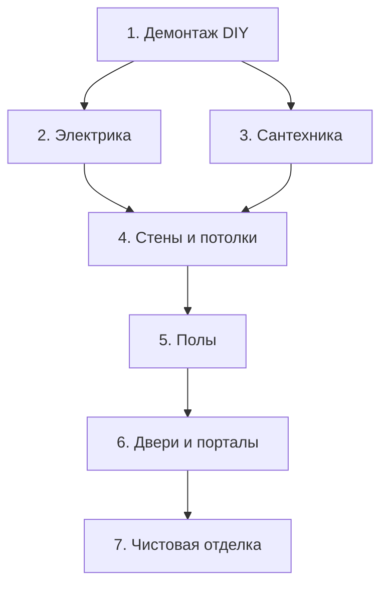

# Общий план этапов ремонта

**Квартира:** Краков, Czyżyny, Os. Akademickie  
**Площадь:** ~100 м² по полу, ~300 м² стен, двухуровневая  
**Дата начала планирования:** 2026-04-26

---

## Последовательность этапов

```
┌──────────────────────────────────────────────────────────┐
│  ЭТАП 0 — Проектирование  ······  📐 ПРОЕКТИРОВЩИК      │
│  План портала (кухня-комната), проект разделительной стены│
│  (с ТВ-зоной и кондиционерами)                          │
├──────────────────────────────────────────────────────────┤
│  ЭТАП 1 — Демонтаж и очистка  ·····  🔧 СВОИМИ РУКАМИ   │
│  Снятие ламината, плитки, очистка стен от никотина       │
├──────────────────────────────────────────────────────────┤
│  ЭТАП 2 — Возведение стен  ·······  🏗️ ПОДРЯДЧИК        │
│  Строительство стены для разделения комнаты, портал      │
├──────────────────────────────────────────────────────────┤
│  ЭТАП 3 — Инженерные сети  ·······  ⚡ ПОДРЯДЧИКИ        │
│  Электрика, Сантехника, трассы для Кондиционеров        │
├──────────────────────────────────────────────────────────┤
│  ЭТАП 4 — Стены и потолки  ·········  🏗️ ПОДРЯДЧИК      │
│  Штукатурка, шпаклёвка, выравнивание, базовая покраска   │
├──────────────────────────────────────────────────────────┤
│  ЭТАП 5 — Полы  ···················  🪵 ПОДРЯДЧИК        │
│  Нивелир, инженерная доска, плинтусы                    │

├──────────────────────────────────────────────────────────┤
│  ЭТАП 6 — Двери, окна, порталы  ···  🚪 ПОДРЯДЧИК       │
│  Внутренние двери, портал кухня-комната, подоконники     │
├──────────────────────────────────────────────────────────┤
│  ЭТАП 7 — Чистовая отделка  ·······  🎨 СМЕШАННО        │
│  Мебель, освещение, декор, техника                       │
└──────────────────────────────────────────────────────────┘
```

---

## Сводная таблица

| №  | Этап                     | Кто делает       | Файл                            | Статус        |
|----|--------------------------|------------------|----------------------------------|---------------|
| 0  | Проектирование           | Проектировщик    |                                  | 🔲 Не начат   |
| 1  | Демонтаж и очистка       | **Своими руками** | `01_demolazh.md`                | ✅ Спланирован |
| 2  | Возведение стен          | Подрядчик        | `02_stena_tv_klima.md`          | ✅ Спланирован |
| 3  | Инженерные сети          | Подр. / **Свои** | `02_elektryka.md`               | 🔲 В процессе |
| 4  | Кондиционеры и Воздух    | Подрядчик (Авт.) | `08_klimatyzacja_rekuperacja.md`| ✅ Спланирован |
| 5  | Сантехника               | Подрядчик        | `03_santehnika.md`              | 🔲 Не начат   |
| 6  | Стены и потолки          | Подрядчик        | `05_steny_potolki.md`           | 🔲 Не начат   |
| 7  | Полы                     | Подрядчик        | `04_poly.md`                    | 🔲 Не начат   |
| 8  | Двери, окна, порталы     | Подрядчик        | `06_dveri_okna.md`              | 🔲 Не начат   |
| 9  | Чистовая отделка         | Смешанно         | `07_chistovaya_otdelka.md`      | 🔲 Не начат   |

---

## Принципы

1. **Грязное → чистое.** Сначала демонтаж и пыльные работы, потом чистовые.
2. **Скрытое → видимое.** Электрика и сантехника идут в стены до штукатурки.
3. **Стены → полы.** Стены красятся/штукатурятся до укладки доски, чтобы не испачкать.
4. **Двери и порталы — после стен.** Наличники ставятся по чистой стене.
5. **Мебель — последняя.** Заносится, когда полы уложены и стены готовы.

---

## Зависимости между этапами



---

## Важные решения (открытые вопросы)

- [ ] **Портал кухня → комната:** Несущая стена — нужна экспертиза конструктора (инженер-строитель)
- [ ] **Замурованный вход в спальню:** Узаконено ли? Совпадает с документами?
- [ ] **Тёплый пол:** В каких именно помещениях? Влияет на тип клея, стяжки, доски
- [ ] **Лестница:** Оставляем / реставрируем / заменяем?
- [ ] **Какие стены под венецианку, какие под покраску?**
