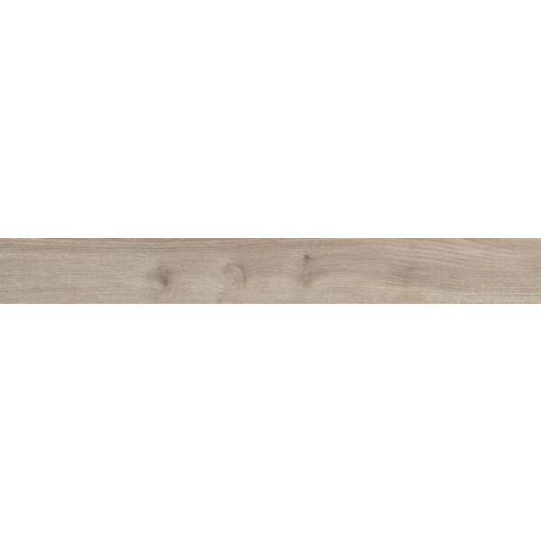
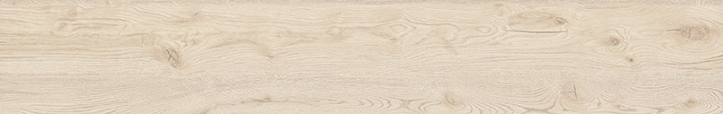

# Пол под дерево (коридор / кухня) — исследование

**Статус:** 🔍 В работе | **Обновлено:** 2026-06-23 | **Тэги:** плитка, gres, под дерево, пол, коридор, кухня, Cerrad, Paradyż, Tubądzin

**Контекст:** пол для **коридора и кухни** — керамогранит **под дерево/доску**, оттенок **светло-серый ближе к белому, с текстурой** древесины. Матовый, R10 (проход/влажная зона), ректифицированный. Эталон выбран у Cerrad (Acero Bianco) — ищем аналоги по цвету у Paradyż и Tubądzin.

> Это отдельная тема от ванной (плитка ванной → [`plitka_vannaya.md`](./plitka_vannaya.md)).

---

## Кандидаты по 3 брендам

| Бренд | Коллекция / цвет | Формат | R | Ректиф. | Цена brutto | Цвет |
|---|---|---|---|---|---|---|
| **Cerrad** (эталон) | Acero Bianco | 20×120 (19,3×120,2) | **R10 B** | да | **159,90 zł/м²** (кат.) | светлое прохладное серо-белое |
| **Paradyż** | **Wildland Light** | 14,8×89,8 / 19,8×119,8 | **R10** | да | **97–130 zł/м²** | серо-бежевое, холодный подтон |
| **Tubądzin** | **Wood Grain White STR** | 19×119,8 (и 23×179,8) | **R10 A** | да | **138–166 zł/м²** (кат. 184,50) | светлое, теплее/бежевее |

Все три — gres, мат, ректиф., R10, формат «доска». Параметры сверены по дилерам и сайтам производителей.

---

## Как выглядят (фото проверены)

### Cerrad Acero Bianco (эталон)
Светлое прохладное серо-белое дерево с мягкой текстурой. Уже выбран в [`plitka_vannaya.md`](./plitka_vannaya.md).

### Paradyż Wildland (серия Light/Warm/Naturale/Dark — берём **Light**)

*Серо-бежевое дерево, холодный подтон, мягкие сучки/прожилки (на фото вариант ближе к Warm; **Light — ещё светлее**). Вдохновение — дуб. Это **компаньон-пол коллекции Harmony** из PDF-каталога Paradyż → связка со стенами Harmony уже «родная».*

### Tubądzin Wood Grain White STR

*Светлое дерево с выраженной текстурой (сучки, прожилки), но **теплее/бежевее**, менее «серое», чем Acero/Wildland.*

---

## Вывод: что ближе к «серое к белому с текстурой»

| Близость к критерию | Бренд | Почему |
|---|---|---|
| 🥇 ближе всего | **Paradyż Wildland Light** | холодный серо-белый подтон, светлое, текстура дуба; + дешевле всех (~97–130); + это родной пол-компаньон для стен Paradyż Harmony |
| 🥈 | Cerrad Acero Bianco | прохладное серо-белое — эталон, но дороже (~160) |
| 🥉 | Tubądzin Wood Grain White | красивое, но **теплее/бежевее** — дальше от «серого» |

💡 **Рекомендация:** если выбираешь стены **Paradyż Harmony** для ванной — логично брать **Wildland Light** на пол коридора/кухни: один бренд, родная связка из каталога, холодный светлый оттенок попадает в твой запрос, и цена ниже. Если стены другого бренда — Acero Bianco остаётся надёжным эталоном.

---

## Перепроверка (agy → я по фактам)

- Подбор делегирован agy; названия и характеристики **сверены по дилерам и сайтам**:
  - Paradyż Wildland Light — gres szkl. rekt. mat, **R10**, gatunek 1, ~97–130 zł (abcplytki, Ceneo, home100). ✅
  - Tubądzin Wood Grain White STR — gres 19×119,8, **R10 A**, rekt., ścieralność IV, кат. 184,50 / дилеры 138–166. ✅ (офиц. tubadzin.pl)
  - agy также предложил Paradyż Trophy Bianco (~99) и Soulwood, Tubądzin Holiday/Wood Craft — рабочие альтернативы, но Wildland/Wood Grain — основные.
- **Цвет оценён визуально** (фото выше): Wildland холоднее/серее, Wood Grain теплее.

---

## Следующие шаги

- [ ] Сверить вживую тон Wildland Light vs Acero Bianco vs Wood Grain White на экспозиции (фото в сети тонируют по-разному).
- [ ] Решить связку: стены ванной + пол коридора одним брендом? (Paradyż Harmony + Wildland Light — самый цельный вариант).
- [ ] Уточнить цену через подрядчика (rabat wykonawczy) → [`../05_finansy/vat_8_percent.md`](../05_finansy/vat_8_percent.md).

---

## Ссылки

- Cerrad Acero Bianco: cerrad.com/produkty/acero-bianco/
- Paradyż Wildland Light: abcplytki.pl/732-wildland-paradyz · home100.pl (19,8×119,8, R10)
- Tubądzin Wood Grain White STR: tubadzin.pl/produkt/wood-grain-white-str-plytka-gresowa-029441
