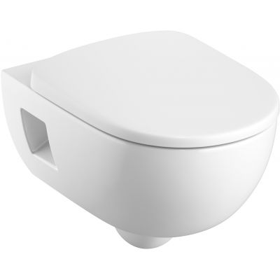

# Сантехника — душ, гигиенический душ, унитаз

**Статус:** 🔍 В работе | **Обновлено:** 2026-06-23 | **Тэги:** сантехника, душ, гиг. душ, унитаз, KOŁO, ванная

**Контекст:** Квартира в Кракове. Выбор душевого комплекта, гигиенического душа (бидетты) и подвесного унитаза.

---

## 1. Душевой комплект (Deszczownica z baterią)

### 🔍 Рассматриваемая модель: Deante Cascada (NAC 04HT)

* **Тип:** Настенный / наружный монтаж (natynkowy)
* **Смеситель:** Термостатический, с блокировкой температуры на 38°C
* **Покрытие:** Хром
* **Ссылка на магазин:** [Łazienki.eco — Deante Cascada](https://lazienki.eco/pl/p/Deante-Cascada-Deszczownica-z-bateria-prysznicowa-termostatyczna-NAC04HT/13889)
* **Ценовой диапазон:** ~1 190 – 1 440 zł (в среднем в интернет-магазинах около 1 199 zł)

#### Основные характеристики:
* Верхний душ + ручной душ.
* Регулируемая высота душевой штанги.
* Система Anti-calc для легкой очистки от накипи.

---

## 2. Гигиенический душ (Bidetta podtynkowa) — Варианты

Рассматриваются два основных варианта гигиенического душа скрытого монтажа (podtynkowy).

### 🔍 Вариант А: Deante Silia (BQS F34M)

* **Тип:** Однорычажный гигиенический душ скрытого монтажа со смесителем и лейкой
* **Покрытие:** Матовая сталь
* **Ссылка на магазин:** [Łazienki.eco — Deante Silia](https://lazienki.eco/pl/p/Deante-Silia-bateria-bidetowa-podtynkowa-ze-sluchawka-stal/8442)
* **Ценовой диапазон:** ~880 – 1 200 zł (регулярная цена около 1 199 zł, по акциям бывает от ~880 zł)

#### Преимущества модели:
* Кнопка **start-stop** непосредственно на лейке (удобное управление потоком).
* Шланг с системой **Anti-twist** (защита от перекручивания).
* Корпус из высококачественной латуни.
* Компактный и эстетичный дизайн серии Silia.
* Гарантия производителя: 7 лет.

---

### 🔍 Вариант Б: Комплект HANSGROHE Logis (32129111)

Набор собирается из следующих компонентов скрытого монтажа (хром):

| Артикул | Описание компонента (PL) | Описание (RU) | Примерная цена | Примечания |
|---|---|---|---|---|
| **13620180** | Zestaw podstawowy do baterii natryskowej podtynkowej | Скрытая часть смесителя (iBox / универсальный блок) | 390 – 600 zł | Базовая монтажная часть |
| **71606000** | Logis bateria prysznicowa podtynkowa - element zewnętrzny | Внешняя часть смесителя Logis (рычаг и накладка) | 140 – 250 zł | Серия Logis |
| **32129000** | Bidette zestaw bidetowy (słuchawka + wąż + uchwyt) | Набор для бидетты (лейка, шланг, настенный держатель Porter) | 300 – 400 zł | **Внимание:** В базах данных отмечен как архивный/снятый с производства. Может быть дефицит на складах. |
| **27454000** | FixFit przyłącze kątowe węża E z uchwytem | Угловое подключение шланга FixFit E | 95 – 190 zł | Вывод воды из стены |
| **Итого** | **Полный комплект Hansgrohe Logis** | | **~925 – 1 440 zł** | Сборный комплект |

#### Сравнение и особенности:
* **Бренд и надежность:** Hansgrohe — премиальный немецкий бренд с высокой надежностью картриджей и механизмов.
* **Доступность элементов:** Лейка **32129000** снята с производства. В случае её отсутствия можно заменить её на любую другую современную лейку-бидетту от Hansgrohe (например, серию *Sari* или аналогичную современную лейку со шлангом).
* **Стиль:** Выполнен в цвете хром (в отличие от матовой стали у Deante Silia).

---

## Сравнительная таблица гигиенических душей

| Параметр | Вариант А: Deante Silia | Вариант Б: Hansgrohe Logis |
|---|---|---|
| **Тип решения** | Готовый комплект от одного производителя | Сборный комплект (4 артикула) |
| **Цвет / Покрытие** | Матовая сталь | Хром |
| **Бюджет** | ~880 – 1200 zł | ~925 – 1440 zł |
| **Ключевые фичи** | Кнопка start-stop на лейке, шланг Anti-twist | Высокая надежность бренда Hansgrohe |
| **Риски** | — | Артикул лейки 32129000 снят с производства |

---

## 3. Подвесной унитаз (Miska WC wisząca)

### 🔍 Рассматриваемая модель: KOŁO Nova Pro Premium (M33126000)

* **Тип:** подвесная (wisząca), овальная, воронкообразная (lejowa)
* **Технология:** **Rimfree** (без ободка — гигиеничнее, легче чистить, нечему скапливаться под ободком)
* **Крепления:** półkryte (полускрытые)
* **Сток:** горизонтальный (poziomy / poznański)
* **Размеры:** длина 53 см × ширина 36 см
* **Цвет:** белый
* **Производитель:** SANITEC KOŁO (группа Geberit), гарантия **7 лет**
* **Артикул / EAN:** M33126000 / 5906976950309
* **Ценовой ориентир:** ~**1 094 zł** (Ceneo; у дилеров tomdom и др. варьируется)

> ⚠️ **Важно — продаётся БЕЗ сиденья (bez deski).** Крышку-сиденье (желательно **wolnoopadająca** — микролифт, плавное закрывание) нужно докупать отдельно. Уточнить совместимую деску серии Nova Pro и её цену.

#### Почему рассматриваем
* Rimfree — практичная гигиена, актуальный стандарт.
* Подвесной монтаж — под него уже идёт инсталляция (stelaż) в стене; сочетается с планом скрытого монтажа сантехники.
* KOŁO/Geberit — надёжный бренд, 7 лет гарантии.

#### Что уточнить
- [ ] Деска wolnoopadająca для Nova Pro (артикул + цена, ~150–300 zł).
- [ ] Инсталляция (stelaż) + кнопка смыва — KOŁO/Geberit или совместимая (бюджет на комплект).
- [ ] Сверить с планом стены ТВ/санузла — где идёт стояк и крепление инсталляции.

---

## Следующие шаги

- [ ] Выбрать финишное покрытие для санузла (хром vs матовая сталь) — это определит выбор гигиенического душа (Deante Silia или Hansgrohe).
- [ ] Унитаз: докупить деску wolnoopadająca + инсталляцию с кнопкой смыва (см. раздел 3).
- [ ] Проверить наличие лейки Hansgrohe 32129000 у дилеров, если будет выбран вариант Hansgrohe, либо подобрать актуальный артикул-аналог.
- [ ] Передать выбранные модели подрядчику по сантехническим работам для согласования выводов и возможности монтажа подконструкций (iBox / скрытых частей).
