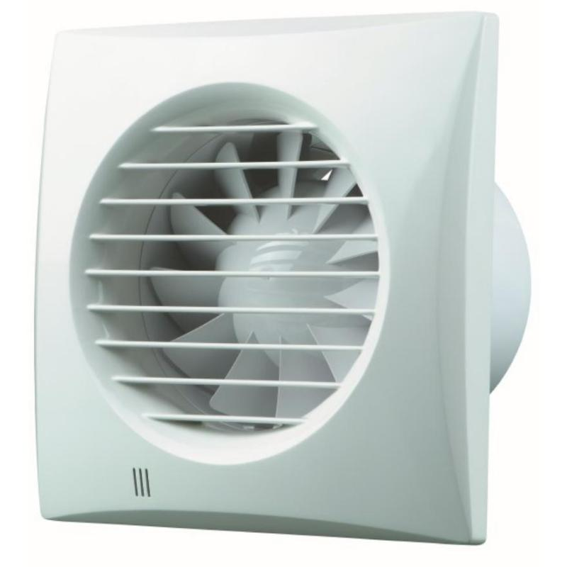

# Вытяжной вентилятор для ванной — исследование

**Статус:** 🔍 В работе | **Обновлено:** 2026-06-23 | **Тэги:** вентилятор, вытяжка, ванная, VENTS, Awenta, Ø100

**Контекст:** вытяжной вентилятор (wentylator wyciągowy/łazienkowy) Ø100 для ванной. Рассматриваем 2 бренда: **VENTS** (дороже, тише) и **Awenta** (дешевле). Данные сверены по дилерам (vents24, ceneo, allegro, onninen).

---

## Что значат буквы в названии (важно для выбора)

| Суффикс | Функция |
|---|---|
| (нет) | просто вкл/выкл (от выключателя света) |
| **T** | **Timer** — задержка выключения после выключения света (2–30 мин) |
| **TH / H** | **Timer + датчик влажности (higrostat)** — сам включается при влажности ~60–90% |

> 💡 **T (таймер)** — самый практичный минимум: свет выключил, вентилятор ещё домолачивает пар 2–30 мин. **H/TH (влажность)** удобно, если в ванной нет окна и важно автоматом ловить сырость — но дороже.

---

## Вариант 1: VENTS (дороже, тише, надёжнее)

Серия **Quiet Mild Duo 100** — двухскоростной (duo), шарикоподшипник (тихий и долговечный), ~90 m³/h, ~7,5 Вт, ~25 dB, IP45.

| Версия | Что умеет | Цена brutto |
|---|---|---|
| Quiet Mild Duo 100 | вкл/выкл | ~220–330 zł |
| Quiet Mild Duo 100**T** | + таймер 2–30 мин | ~243–291 zł |
| Quiet Mild Duo 100**TH** | + таймер + влажность 60–90% | ~279–418 zł |

- **Плюс:** очень тихий (шарикоподшипник, «Quiet»), двухскоростной, надёжный, выше IP.
- **Минус:** дороже Awenta в ~1,5–2 раза.

---

## Вариант 2: Awenta (бюджетный)

Серия **Silence WZ100** — тихий бюджетный осевой Ø100.

| Версия | Что умеет | Цена brutto |
|---|---|---|
| Silence WZ100 | вкл/выкл | ~113–145 zł |
| Silence WZ100**T** | + таймер 3–30 мин | ~132–244 zł |
| Silence WZ100**H** | + влажность (higrostat) + таймер | ~219–316 zł |

- **Плюс:** заметно дешевле, базовый WZ100 от ~113 zł.
- **Минус:** проще VENTS по тишине/долговечности; цены H-версии у дилеров сильно гуляют (219–316).

---

## Сравнение

| Параметр | VENTS Quiet Mild Duo | Awenta Silence WZ |
|---|---|---|
| Класс | премиум, тихий, duo | бюджет |
| Базовая версия | ~220–330 | **~113–145** |
| Таймер (T) | ~243–291 | ~132–244 |
| Влажность (H/TH) | ~279–418 | ~219–316 |
| Подшипник | шарикоподшипник ✅ | втулка (проще) |
| Тишина | очень тихий | тихий |

💡 **Предварительно:** если важна тишина и надолго — **VENTS Quiet Mild Duo 100T** (таймер, ~250–290 zł). Если бюджет в приоритете — **Awenta Silence WZ100T** (~130–200 zł). Версию с датчиком влажности (H/TH) брать, только если ванная без окна и нужна автоматика по сырости.

---

## Следующие шаги

- [ ] Решить: нужен ли датчик влажности (H/TH) — зависит, есть ли окно/как сохнет ванная.
- [ ] Сверить диаметр канала — Ø100 (стандарт) под вывод вентиляции.
- [ ] Уточнить финальную цену выбранной версии у польского дилера.
- [ ] Согласовать с подрядчиком вывод и подключение (от выключателя света / отдельная линия).

---

## Ссылки

- VENTS Quiet Mild Duo 100TH (офиц. дилер): vents24.pl — QUIET MILD DUO 100TH (418,20 zł)
- VENTS Quiet Mild Duo 100T: ceneo.pl (от ~254–291 zł)
- Awenta Silence WZ100 / WZ100T / WZ100H: technika-grzewcza-sklep.pl, onninen.pl, wentylator.co
